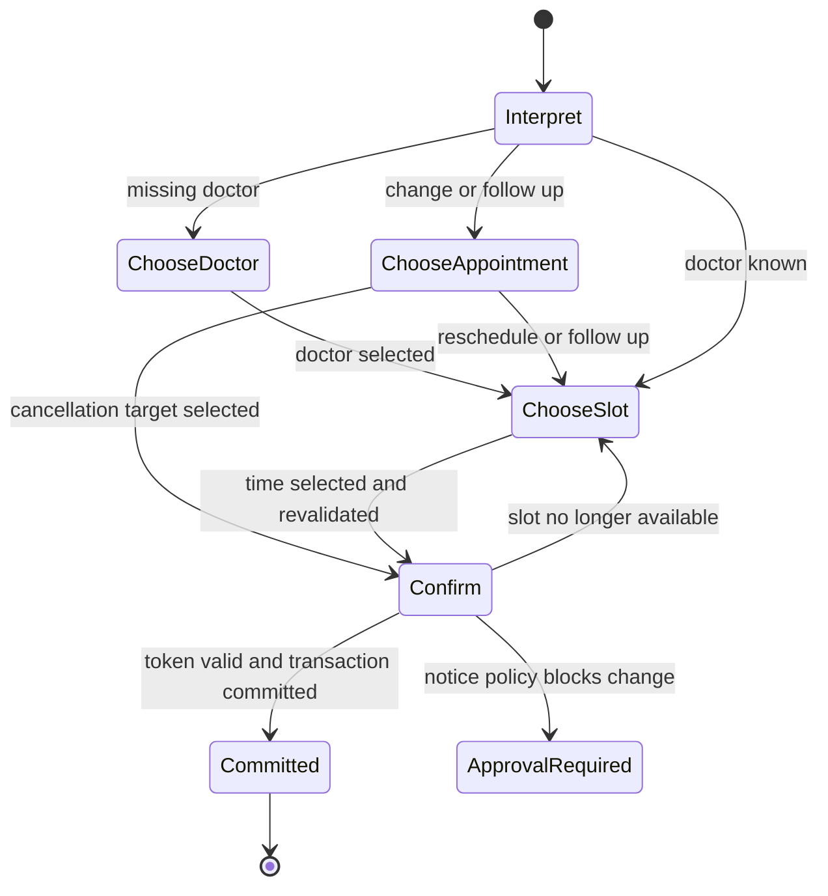

# API and controlled workflow

All booking reads and assistant messages require `Authorization: Bearer <session-token>`. No endpoint accepts a patient identifier. The synthetic demo session endpoint binds the token to one server-selected seeded patient and is disabled unless `DEMO_ENABLED=true`.

| Method | Path | Purpose |
|---|---|---|
| GET | `/health` | Process liveness; does not call external services. |
| GET | `/ready` | Database connectivity and whether Groq is configured; does not validate the key. |
| POST | `/demo/session` | Issue a synthetic patient's expiring session; local demo only. |
| GET | `/doctors?query=Amal&specialty=dermatology` | Search the doctor catalogue. `query=previous` uses the patient's most recent completed visit. |
| GET | `/availability?doctor_id=UUID&start=YYYY-MM-DD&end=YYYY-MM-DD` | Patient-filtered slots; optional `limit` (1-100) and owned `exclude_booking_id` for rescheduling. |
| GET | `/appointments` | Session patient's scheduled, historical and pending appointments. |
| GET | `/appointments/{booking_id}` | Owned appointment lookup. |
| POST | `/assistant/message` | Interpret a message, advance the workflow, or confirm a stored change. |

There are no public doctor-schedule mutation endpoints. Internal service methods `availability`, `lookup`, `book`, `reschedule`, `cancel`, and `schedule_follow_up` form the deterministic tool layer. They can be tested without Groq. Mutations are exposed through the confirmed assistant workflow rather than duplicate unconfirmed HTTP routes.

## Message contract

```json
{
  "request_id": "86cceee0-89cd-42c3-b165-aee9e28224f1",
  "message": "Book Dr. Amal on 2026-10-08 at 09:00",
  "confirmation_token": null
}
```

Use a new UUID for each new message. A retry must reuse the same UUID, message and token. The message is limited to 2,000 characters; unknown request fields are rejected. A `patient_id` field is rejected, not used as identity.

Every assistant response includes `request_id`, `status`, `message`, `data` and `confirmation_token`. The OpenAPI file defines the exact schemas. `data` contains operation-specific objects such as appointment records or candidates.

| Status | Meaning |
|---|---|
| `clarification` | Missing, ambiguous or invalid input; no mutation. |
| `options` | Numbered doctors, appointments or patient-filtered slots are available. Array position + 1 is the option number. |
| `confirmation_required` | A concrete proposed action is stored server-side; inspect its details and token. |
| `success` | A read completed, or a write committed. Inspect `data` to distinguish these. |
| `requires_approval` | Policy disallows automation; no mutation or human contact. |
| `unavailable` | No matching appointments/times, or a chosen slot became unavailable. |
| `error` | Invalid action or provider failure; inspect the safe code. |
| `outcome_unknown` | Database completion is uncertain; retry identical input with the same request ID. |

Normal workflow outcomes use HTTP 200. Invalid request shape is 422, missing/expired identity is 401, reused ID with different input is 409, and provider/database failures are 503. Read endpoint business errors use 400. A nonexistent booking and another patient's booking receive the same not-found message.

## Confirmation example

A proposal response returns a random token and `expires_at`, with the exact candidate or cancellation target. To approve that proposal, send a **new request ID**:

```json
{
  "request_id": "6a2bf6ee-b91c-456b-ae9e-70da7c3b9876",
  "message": "confirm",
  "confirmation_token": "the-token-from-the-proposal"
}
```

The server requires an exact confirmation word (`confirm`, `yes`, `yes confirm`, `نعم`, or `تأكيد`) and the current session's matching token. It does not ask the model whether to authorize a mutation. The token expires after 10 minutes by default. A new interpreted message invalidates the previous proposal; altered criteria produce fresh options/confirmation. `reset`, `start over`, `stop` and `never mind` clear the workflow without a model call. A cancellation of an appointment is a separate confirmed action.

## Workflow states



State persists in PostgreSQL and survives process restarts. A Groq failure leaves the previous committed state unchanged. Provider context includes the clinic clock, stage, current action and displayed scheduling details, not patient identity or tokens. Model output is a strict Pydantic schema with an allowed intent enum and nullable extraction fields. Invalid data produces a safe error/clarification; it never executes arbitrary tools or SQL.

Booking defaults to `consultation` unless the user gives an appointment type; type does not alter trusted slot duration. Exact date/time requests are still checked against templates and existing bookings. Morning means before 12:00; afternoon 12:00-17:00; evening from 17:00. Date-only requests show options. Broad date ranges can be queried through the availability API; the initial natural-language schema extracts one date, not an arbitrary recurrence/range language.

Rescheduling retains the doctor and appointment type. It preserves the original row as `rescheduled` and points to the new confirmed row. Follow-up scheduling updates an existing pending row in place and preserves its parent. Cancellation is a status change, never deletion. Human approval requirements are reported without pretending a human workflow exists.

## Groq configuration and failure handling

The fixed API destination is `https://api.groq.com/openai/v1/chat/completions`. Keys remain in server configuration; redirects are not followed. Strict JSON schema and no tools/streaming avoid mixing unsupported provider features. JSON object mode is an explicit configuration option, not an automatic fallback.

Model output is only an interpretation. Ownership, date horizons, interval conflicts, allowed status changes, notice policy, confirmation and commit success are Python/database decisions. Structured output improves parsing reliability, not medical or semantic correctness.

Rate-limit and temporary server failures get at most one short retry. Long Retry-After values return immediately with a 503 and header. No raw provider error text is returned. Sequential database retries use the operation record; simultaneous requests remain outside the current guarantees.
