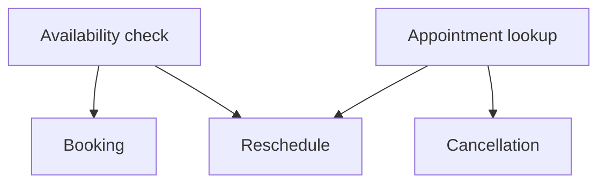
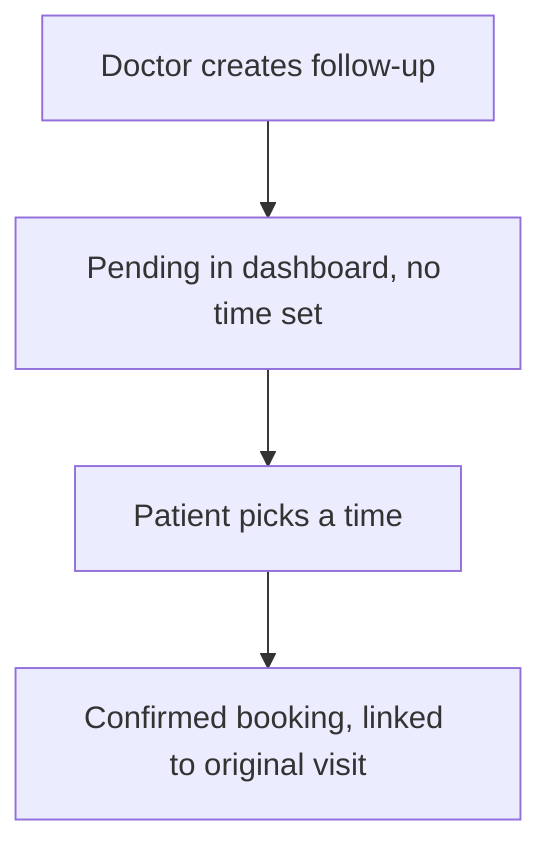

> Design reference retained from the agreed notes. For the implemented scope and resolved details (fixed slot duration, confirmation, deferred escalation and schema additions), see database.md and api-workflow.md.

# Booking Workflow Documentation
### Apex AI Arabia — Patient-Service Assistant, Booking Module

This document covers the design of the booking family of capabilities: availability, booking, rescheduling, cancellation, and follow-up appointments. It reflects decisions made during design review; each non-obvious choice is paired with the reasoning behind it so it can be defended live.

---

## 1. Scope

This service is **patient-facing only**. Doctor-side schedule management (setting weekly slots, recording leave) is assumed to be owned by a separate internal/doctor-facing service and is out of scope here. This assistant only *reads* `slot` and `doctor_leave` — it never writes to them. For the current scope, doctor-side schedule management is assumed to work correctly and to provide valid, non-overlapping slots for each doctor; validation of those templates belongs to that service.

---

## 2. Identity model (this demo)

For this submission, patient identity is established via a **session-based ID**, not full OTP verification. A session is created at the start of a conversation and carries a `patient_id` for its lifetime; every subsequent tool call in that session uses the server-held `patient_id`, never a value extracted from the message text.

This is a deliberate simplification for the 48-hour scope. The full design intent — phone number + OTP verification before a session is granted a `patient_id` — is documented under **Section 8, What I Would Build Next**, along with why it matters for production.

**Guardrail regardless of identity method:** no tool that touches patient-specific data (availability check on the patient side, appointment lookup, booking, reschedule, cancel) may accept a patient identifier from free-text input. The identifier always comes from server-held session state. This is the primary defense against prompt-injection attempts that try to impersonate or query another patient's data.

---

## 3. Data model (locked)

| Table | Columns | Notes |
|---|---|---|
| `patient` | `patient_id` (PK), `patient_name`, `phone_number`, `created_at` | |
| `doctor` | `doctor_id` (PK), `doctor_name`, `specialty_1`, `specialty_2`, `specialty_3` | up to 3 specialties |
| `slot` | `slot_id` (PK), `doctor_id` (FK), `day_of_week`, `start_time`, `end_time` | recurring weekly template; read-only from this service |
| `doctor_leave` | `leave_id` (PK), `doctor_id` (FK), `start_datetime`, `end_datetime`, `reason` (nullable) | supports half-day leave via datetime range; read-only from this service; expired rows filtered out at query time (no archive job — see Section 7) |
| `bookings` | `booking_id` (PK), `patient_id` (FK), `doctor_id` (FK), `slot_id` (FK, nullable until scheduled), `appointment_date` (nullable), `booked_day_of_week`, `booked_start_time`, `booked_end_time`, `type`, `dependent_on_booking_id` (FK, nullable), `status`, `notes` | source of truth for whether a doctor is taken at a given time; time fields are snapshotted at booking time; scheduled bookings reference `slot` |

`bookings.status` values: `confirmed`, `pending_scheduling`, `cancelled`, `no_show`, `completed`, `rescheduled`.

`bookings.dependent_on_booking_id`: null = independent booking; set = this booking is a follow-up/child of the referenced booking.

---

## 4. Capability dependency map

| Capability | Depends on | Notes |
|---|---|---|
| Availability check | Nothing | Reads `slot` + `doctor_leave` + `bookings`; no patient identity needed unless checking the patient's own conflicts |
| Booking | Session identity + Availability check | |
| Rescheduling | Session identity + Appointment lookup + Availability check (for new time) | |
| Cancellation | Session identity + Appointment lookup | No availability check needed |
| Preparation instructions | Nothing (generic) / Appointment lookup (if tied to "my appointment") | RAG lookup |
| Insurance / general questions | Nothing | RAG lookup |
| Escalation | Nothing | Reachable from any stage |



---

## 5. Detailed workflows

### 5.1 Availability check

1. Determine the scheduling window (default: today → today + 90 days; configurable, not hard-coded — see Section 7).
2. For each date in the window, compute its weekday and match against `slot` rows for the requested doctor.
3. Drop any candidate whose time range overlaps a `doctor_leave` row (`leave.start_datetime < candidate_end AND leave.end_datetime > candidate_start`) — this correctly handles half-day leave clipping a single slot.
4. Drop any candidate already taken: a `confirmed` row in `bookings` matching `(doctor_id, appointment_date, booked_start_time)`.
5. For patient-specific availability, query the session patient's `confirmed` bookings across all doctors and remove every overlapping candidate before returning or displaying options. Use `existing_start < candidate_end AND existing_end > candidate_start` with full appointment dates and times; adjacent appointments are allowed. Apply this filtering to booking, rescheduling, and follow-up scheduling. During rescheduling, exclude the booking being replaced from conflict checks. Generic availability without a patient session does not perform this personal conflict filter.
6. Return the remaining candidates grouped by date.

**Example structured response:**
```json
{
  "doctor_id": "D001",
  "doctor_name": "Dr. Al-Harbi",
  "available_slots": [
    {"date": "2026-10-05", "day": "Monday", "start_time": "10:00", "end_time": "10:30"},
    {"date": "2026-10-07", "day": "Wednesday", "start_time": "14:00", "end_time": "14:30"}
  ]
}
```

### 5.2 Booking

**Ways a patient can initiate a booking:**
- By doctor name (patient already knows who they want)
- By specialty (list matching doctors, optionally auto-pick earliest availability)
- By symptom/reason, softly mapped to a specialty (never presented as a diagnosis — offered as a suggestion the patient confirms or overrides)
- By returning to a previously seen doctor (from booking history)
- Via a follow-up chain (Section 5.5) — doctor and reason already decided upstream

**Steps:**
1. Resolve the doctor (directly, via specialty list, or via follow-up).
2. Resolve appointment type/reason (drives duration and later prep-instruction lookup).
3. Run the availability check (Section 5.1) for that doctor, scoped to the patient's session.
4. Present candidate slots; patient selects one.
5. Re-validate the chosen slot against current database availability, including the patient's confirmed appointments with any doctor, immediately before writing. This also applies to directly requested times that were not selected from displayed options. This catches stale selections but does not prevent simultaneous requests from racing; concurrency protection is deferred to Section 8.
6. Write a `bookings` row: `status = confirmed`, snapshot `booked_day_of_week` / `booked_start_time` / `booked_end_time` from the chosen candidate, `dependent_on_booking_id = null`.
7. Confirm to the patient with the booking ID and details; offer relevant prep instructions if the appointment type has any.

### 5.3 Rescheduling

1. Look up the existing booking by ID (scoped to the session's `patient_id` — a patient can only reschedule their own bookings).
2. Run the availability check for the new desired time, including patient conflicts across all doctors and excluding the booking being replaced. Filter conflicting candidates before displaying options and recheck the selected time before writing.
3. If the requested change falls **within 24 hours of the current appointment time**, do not execute automatically — route to escalation for human approval (flagged as a policy to anticipate, not yet confirmed in the brief — see Section 7).
4. If outside 24 hours: write a new booking row for the new time (`status = confirmed`), mark the old row `status = rescheduled` with a `superseded_by_booking_id` pointer to the new row (preserves audit history).
5. Confirm the new time to the patient.

### 5.4 Cancellation

1. Look up the existing booking by ID (scoped to session `patient_id`).
2. If **more than 24 hours** before the appointment: mark `status = cancelled` directly.
3. If **within 24 hours**: do not cancel automatically — route to escalation for human approval.
4. Confirm the outcome to the patient (either "cancelled" or "a team member will confirm your cancellation shortly").

### 5.5 Follow-up chain

1. A doctor (via the separate doctor-facing service, out of scope here) creates a `bookings` row with `status = pending_scheduling`, `appointment_date = null`, `dependent_on_booking_id` set to the original visit's booking ID.
2. This appears in the patient's dashboard/query results as an unscheduled item linked to the original visit.
3. Patient asks to schedule it; the assistant already knows the doctor and type from the existing row, so it goes straight to the availability check (Section 5.1) — no need to re-collect doctor/specialty/reason.
4. Patient picks a time; recheck availability and patient conflicts across all doctors, then the same row is updated in place (`appointment_date`, snapshot fields set, `status = confirmed`).



---

## 6. Guardrails baked into these flows

- Patient identifiers are never taken from free text — always from session state (defends against impersonation / prompt injection).
- No success message is sent to the patient unless the underlying write to `bookings` is confirmed — a timed-out or failed write must not produce "your appointment is booked/cancelled/rescheduled."
- Symptom-to-specialty mapping is offered as a suggestion, never as a diagnosis or medical claim.
- The 24-hour threshold on reschedule/cancel is a hard boundary, not something the assistant reasons its way around from conversational context.
- Booking, rescheduling, and follow-up scheduling filter patient conflicts across all doctors before displaying options and re-validate availability immediately before writing. Cancellation does not require an availability check. These checks do not guarantee safety under concurrent requests; locking and database race-condition protection are deferred to Section 8.

---

## 7. Assumptions

- **Identity**: session-based `patient_id` is sufficient for this demo; full phone + OTP verification is deferred (Section 8).
- **Scheduling window**: default availability horizon is 90 days; this is a configurable value, not specified by the brief.
- **Doctor schedule ownership and correctness**: `slot` and `doctor_leave` are populated and maintained by a separate doctor-facing service; this assistant only reads them. That service is assumed to work correctly and ensure each doctor's slot templates are valid and non-overlapping. Bookings use the supplied slot boundaries. Doctor-side schedule validation is outside this scope; filtering already-booked slots and the patient's own conflicts remains in scope.
- **Concurrency**: the current demo assumes booking mutations are not submitted simultaneously for competing slots or the same patient. Availability is checked before display and again before writing, but same-slot/date uniqueness is now enforced by the database; mutex locking and broader race-condition protection remain deferred.
- **Leave archiving**: expired `doctor_leave` rows are excluded via a query-time filter (`end_datetime >= NOW()`), not a scheduled archive job — appropriate for this scale; revisited under production architecture.
- **24-hour policy**: applied to both cancellation and rescheduling, though the brief's disclosed "surprise scenario" only confirms this for cancellation. Treating reschedule the same way is a judgment call, stated here explicitly rather than assumed silently.
- **Single location/branch**: no multi-branch or location-based routing is modeled; out of scope for this assessment.
- **No extra one-off doctor slots**: only recurring weekly `slot` templates and `doctor_leave` are modeled; a doctor adding a one-off extra slot is not supported in this scope.

---

## 8. What I would build next

- **Concurrency and race-condition protection**: add database-backed locking and/or overlap constraints so simultaneous booking, rescheduling, and follow-up requests cannot double-book a doctor or create overlapping appointments for a patient. Coordinate competing changes to the same booking, handle conflicts cleanly, and test concurrent requests. An in-process mutex alone would not protect multiple backend workers.

- **OTP verification**: phone number capture, OTP generation/hashing, expiry, attempt-limiting, and binding a verified phone number to a `patient_id` before a session is trusted with any patient-specific data. The session-based ID used in this demo is a stand-in for the trust boundary this would establish in production.
- **Doctor-leave archiving job**: move expired `doctor_leave` rows to a cold table on a schedule, once table volume at production scale makes the query-time filter costly.
- **Slot identity implemented (2026-09-29)**: scheduled bookings now store a foreign key to `slot`. A partial unique index on `(slot_id, appointment_date)` for confirmed bookings prevents duplicate occupancy. Cancelled/rescheduled records retain their slot reference without blocking reuse; pending follow-ups have null slot/date until scheduled.

## Slot/date schema update — 2026-09-29

This update supersedes earlier statements deferring all database race protection. The confirmed slot/date unique index is implemented, with safe backfill and conflict responses. Cross-slot patient overlaps, concurrent changes to one booking/session, and concurrent request replay remain deferred.
