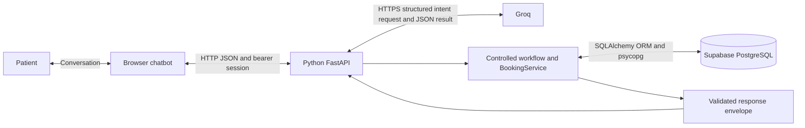

# Chatbot, Python and SQL: Communication Contracts and Workflow Examples

Implementation reference: 30 September 2026.

## 1. Purpose and assessment coverage

This document explains the implemented booking assistant: what each component sends, how inputs are validated, how database changes occur, and how verified results return to the patient. Examples are synthetic. UUIDs and tokens in examples are illustrative and are not credentials.

| Assessment requirement | Evidence described here | Coverage boundary |
|---|---|---|
| Part 1: Python REST app with `POST /assistant/message`; structured outputs with validation; setup and assumptions | Sections 3–7 explain the endpoint, Pydantic contracts and validation. Setup is in the README. | Booking and insurance/general retrieval implemented. Preparation content and escalation delivery remain separate work. |
| Part 3: tool integration, input validation, failure handling and confirmed tool output | Sections 8–12 document deterministic service methods and PostgreSQL results. | The implementation uses real database-backed booking services, with mocked provider/test fixtures; it is not a provider tool-calling loop. Human escalation is not implemented. |
| Part 4: clarification, tool execution and final response | Sections 9–10 contain complete multi-message scenarios. | Implemented booking workflows, not merely a proposed architecture. |
| Part 5: ambiguity, unavailable appointments, invalid IDs, errors and sensitive information boundaries | Sections 7 and 12 describe the implemented responses and trust boundaries. | Human escalation delivery remains out of scope. |
| Part 11: controlled workflow versus autonomous agent | Section 13 explains the choice in this implementation. | Provides the booking-specific rationale. |
| Part 12: assistant claims rescheduling succeeded despite a timeout | Section 12.3 describes diagnosis, expected behaviour and relevant evidence. | Distinguishes confirmed failure from uncertain commit outcome. |

This is supporting evidence for these requirements, not a claim that the entire assessment is complete. The code, tests and demonstrated behaviour remain the evidence of execution.

## 2. Components and communication directions



The browser is the conversational interface. Groq interprets natural language. Python controls the workflow, dates, authorization and business rules. PostgreSQL stores records and enforces database constraints.

**There is no browser-to-database connection, no Groq-to-database connection, and no model-generated SQL.** Database rows do not go back to Groq to decide whether a mutation succeeded. Python constructs the patient-facing result from actual service execution.

| Boundary | Transport and representation |
|---|---|
| Browser → Python | HTTP `POST /assistant/message`, JSON body, bearer session header. Local demo uses localhost HTTP; remote deployment would require HTTPS. |
| Python → Groq | HTTPS request to the server-configured Groq chat-completions endpoint, server-side key, system instructions, compact context and current message. |
| Groq → Python | JSON matching the `Interpretation` schema, validated again locally. |
| Python → PostgreSQL | SQLAlchemy ORM operations compiled into parameterized SQL and executed by psycopg. |
| PostgreSQL → Python | Rows, successful statement/commit results, or database exceptions. |
| Python → Browser | `AssistantResponse` JSON for conversation outcomes, or HTTP/API validation errors. |
| Browser → Patient | Messages, numbered choices, appointment cards, confirmation actions and retry guidance. |

## 3. Patient identity and initial connection

1. In the synthetic demo, the browser calls `POST /demo/session`.
2. The server chooses the configured synthetic patient. The browser does not supply `patient_id`.
3. Python creates a random bearer token and stores its SHA-256 hash in `patient_session`, together with patient ID, expiry and initial state.
4. The raw bearer token is returned to the browser and stored in its tab-scoped `sessionStorage`.
5. Subsequent patient API calls include:

```http
Authorization: Bearer <patient-session-token>
Content-Type: application/json
```

Python hashes the supplied token, finds the matching session and checks expiry. The default lifetime is eight hours. The session's patient ID determines ownership for all booking operations. A booking ID belonging to another patient receives the same not-found response as an unknown ID.

This is synthetic demo identity, not an implemented OTP/login system. The public health and configuration endpoints do not grant appointment access.

## 4. Browser → Python: `MessageRequest`

```json
{
  "request_id": "11111111-1111-4111-8111-111111111111",
  "message": "Book Dr. Amal two weeks later",
  "confirmation_token": null
}
```

| Field | Validation and meaning |
|---|---|
| `request_id` | Required UUID. A new conversation turn gets a new ID. Retrying that same turn reuses the same ID and payload. |
| `message` | Required string, 1–2,000 characters. |
| `confirmation_token` | Optional string, maximum 128 characters. Sent only when approving a stored proposal. |

Unknown fields are forbidden. For example, adding `patient_id` is rejected rather than accepted as authority. FastAPI/Pydantic rejects invalid request shapes with HTTP 422 before the workflow runs.

The browser sends ordinary text even when the patient clicks an option: clicking option 2 sends `"Option 2"`. It does not submit a fabricated booking object. Confirmation buttons send `"confirm"` and the token returned by the server. Recognized typed English confirmations, such as `yes`, also attach the current proposal token in the frontend.

The compatible `/booking/propose` endpoint from the earlier guided UI remains available, but the current chatbot uses `/assistant/message` for patient actions.

## 5. Python → Groq: instructions and compact context

For natural-language turns, Python sends:

- A system instruction defining allowed scheduling intents and extraction rules.
- The current user message, treated as untrusted input.
- Clinic date/time and timezone.
- Current workflow action and stage.
- Current date or date range, doctor query, time preference and weekday filter.
- Public scheduling details from displayed options.
- The JSON schema required for the result.

Example context, abbreviated:

```json
{
  "clinic_now": "2026-09-30T10:00:00+03:00",
  "timezone": "Asia/Riyadh",
  "current_action": "book",
  "stage": "slot",
  "doctor_query": "Amal",
  "appointment_date": "2026-10-14",
  "date_from": null,
  "date_to": null,
  "options": [
    {
      "doctor_name": "Dr. Amal Demo",
      "appointment_date": "2026-10-14",
      "start_time": "09:00:00",
      "end_time": "09:30:00"
    }
  ]
}
```

For the next message, `"Can I have a day later?"`, the model should extract a one-day shift from the discussed date, not tomorrow from the current clock. Python performs that calculation.

The server does not add stored patient names, phone numbers, patient IDs, notes, session tokens or database credentials to model context. User-entered text itself may contain personal information or booking IDs; it is forwarded as the current message. The full browser transcript is not sent to Groq. Persistent workflow state supplies the relevant context.

The configured default is Groq-hosted `openai/gpt-oss-20b`, with strict JSON-schema output. It uses the Groq key and endpoint, not an OpenAI API key. JSON-object mode is an explicit alternate configuration, not an automatic fallback.

## 6. Groq → Python: `Interpretation`

A complete extraction example:

```json
{
  "intent": "book",
  "doctor_query": "Amal",
  "specialty": null,
  "appointment_date": null,
  "date_from": null,
  "date_to": null,
  "months_after": null,
  "days_after": 14,
  "shift_days": null,
  "requested_weekday": null,
  "start_time": null,
  "booking_id": null,
  "option_number": null,
  "appointment_type": null,
  "time_preference": null
}
```

All fields are required in the extraction object; unused values must be null. Extra fields are forbidden and Pydantic strict mode rejects inappropriate types.

| Field | Allowed values / purpose |
|---|---|
| `intent` | `book`, `availability`, `reschedule`, `cancel`, `follow_up`, `appointments`, `continue`, `unknown`, `knowledge`, `emergency`, `refuse` |
| `doctor_query`, `specialty` | Newly supplied doctor name/query or specialty. |
| `appointment_date` | Exact date string; parsed and checked by Python. |
| `date_from`, `date_to` | Inclusive date-range strings; parsed and checked by Python. |
| `months_after` | Integer 0–12. Python adds calendar months. |
| `days_after` | Integer 0–365 relative to today's clinic date. Two weeks means 14 days. |
| `shift_days` | Integer −365–365 relative to the date/window being discussed. |
| `requested_weekday` | Integer 0–6, Monday through Sunday. |
| `start_time` | Requested local time string; parsed by Python. |
| `booking_id` | A booking identifier from the request; parsed as UUID and checked for ownership. |
| `option_number` | Integer referring to a displayed option; Python validates its range and stage. |
| `appointment_type` | Descriptive appointment type; does not override slot duration. |
| `time_preference` | `morning`, `afternoon`, `evening`, or null. |

Date/time and booking-ID extraction fields are strings at this boundary. Calendar validity, UUID validity and business meaning are checked later; JSON-schema compliance alone does not prove them correct.

For `"A day later?"`, the relevant extraction is `intent=continue, shift_days=1`. For `"Thursday instead?"`, it is `intent=continue, requested_weekday=3`. Other newly absent fields are null; the workflow retains the already chosen doctor and action.

Exact numbered replies, reset commands and confirmations are handled directly by Python without asking Groq to interpret them.

## 7. Python validation and state

Validation proceeds through separate layers:

1. **Request shape:** required fields, UUID request ID, text length and no extra fields.
2. **Session identity:** valid token hash and unexpired session.
3. **Replay identity:** compare session/request ID and payload fingerprint with an existing operation.
4. **Model output:** allowed intent, strict schema and complete generation.
5. **Workflow state:** valid option number, correct choice stage, sufficient doctor/date information.
6. **Business rules:** ownership, valid dates, booking horizon, doctor schedule, leave, patient conflicts, status transitions and notice policy.
7. **Confirmation:** recognized confirmation text, correct session-specific token and unexpired proposal.
8. **Database constraints:** foreign keys, check constraints and unique confirmed slot/date.
9. **Commit:** return mutation success only after the transaction commits.

`patient_session.state` stores the current action, selections, options and proposal. The confirmation token and its default ten-minute expiry are stored there too. A proposal does not reserve a slot. The selected time is revalidated when confirmation arrives.

The browser's transcript is presentation state. The database session state is authoritative for interpreting a selection and authorizing a confirmation.

### Dated slot format: `Candidate`

```json
{
  "doctor_id": "10000000-0000-0000-0000-000000000001",
  "doctor_name": "Dr. Amal Demo",
  "slot_id": "30000000-0000-4000-8000-000000000001",
  "appointment_date": "2026-10-14",
  "start_time": "09:00:00",
  "end_time": "09:30:00"
}
```

`Candidate` has typed UUID, date and time fields and forbids extra fields. The backend constructs it from actual doctor/slot records. Availability and revalidation establish that the candidate is usable.

## 8. Python ↔ PostgreSQL

SQLAlchemy maps Python objects to the private `booking` schema. Psycopg executes the SQL over the configured PostgreSQL connection. The local configuration uses the Supabase session pooler with certificate and hostname verification. Credentials remain in `.env`, excluded from version control and packaged output.

The runtime login can read schedules and patients, read/create/update bookings and sessions, and read/create operation records. It cannot delete bookings, edit doctor schedules, manage schema/roles or bypass RLS. Patient ownership is enforced in Python; runtime database policies trust the backend across its patients.

| Table | Role in communication |
|---|---|
| `doctor` | Resolve a doctor query and display catalogue details. |
| `slot` | Weekly templates: doctor, weekday and start/end times. |
| `doctor_leave` | Dated periods that block candidate times. |
| `patient` | Patient record referenced by the session and bookings. |
| `bookings` | Actual appointments, pending follow-ups, historical rows and relationships. |
| `patient_session` | Identity binding, expiry and persistent workflow state. |
| `operation` | Request fingerprint and saved response for sequential replay. |

The following SQL is illustrative equivalent SQL, not a literal log or model output. Actual queries are generated by SQLAlchemy with bound parameters.

```sql
-- Read recurring templates for a doctor.
SELECT * FROM booking.slot
WHERE doctor_id = :doctor_id
ORDER BY start_time;

-- Read occupied intervals relevant to this doctor's availability and this patient.
SELECT * FROM booking.bookings
WHERE status = 'confirmed'
  AND appointment_date BETWEEN :start_date AND :end_date
  AND (doctor_id = :doctor_id OR patient_id = :session_patient_id);

-- Read active appointments owned by this session's patient.
SELECT * FROM booking.bookings
WHERE patient_id = :session_patient_id
  AND status IN ('confirmed', 'pending_scheduling');
```

The current implementation fetches the doctor's templates, then matches each calendar date's `weekday()` in Python. It does not store a separate slot row for every future date.

Returned rows become ORM objects. `BookingService` uses them for calculations; `booking_data()` converts booking objects to JSON-compatible fields. No raw database exception text is sent to the patient.

### Transaction example

```sql
BEGIN;
-- Revalidate using current schedules, leave and confirmed bookings.
INSERT INTO booking.bookings
  (booking_id, patient_id, doctor_id, slot_id, appointment_date,
   booked_day_of_week, booked_start_time, booked_end_time,
   type, status, created_at)
VALUES
  (:new_id, :session_patient_id, :doctor_id, :slot_id, :date,
   :weekday, :start, :end, :type, 'confirmed', :created_at);

UPDATE booking.patient_session SET state = :cleared_state
WHERE session_id = :session_id;

INSERT INTO booking.operation
  (session_id, request_id, request_hash, response, created_at)
VALUES (:session_id, :request_id, :hash, :response_json, :created_at);
COMMIT;
```

This illustrates the logical unit of work; ORM flush ordering can differ. `BookingService` flushes changes but does not commit. The API commits the booking mutation, session change and saved response together. A successful flush is not yet a durable success response.

## 9. Python → browser: `AssistantResponse`

```json
{
  "request_id": "11111111-1111-4111-8111-111111111111",
  "status": "options",
  "message": "These times are available. Choose an option number to continue.",
  "data": {
    "kind": "slot",
    "options": [
      {
        "doctor_id": "10000000-0000-0000-0000-000000000001",
        "doctor_name": "Dr. Amal Demo",
        "slot_id": "30000000-0000-4000-8000-000000000001",
        "appointment_date": "2026-10-14",
        "start_time": "09:00:00",
        "end_time": "09:30:00"
      }
    ]
  },
  "confirmation_token": null
}
```

The envelope is a Pydantic model with a restricted status enum. `data` is currently a flexible dictionary rather than a discriminated union of individually typed result schemas. Its supported shapes are constructed by Python:

| Shape | Meaning |
|---|---|
| `data.kind` + `data.options` | Doctor, appointment or dated-slot choices. Position + 1 is the option number. |
| `data.candidate`, `data.action`, `data.expires_at` | Proposed dated change. |
| `data.booking` | A cancellation target or a resulting booking, depending on status/action. |
| `data.appointments` | Owned active appointment list. |
| `data.code` | A safe machine-readable error or policy code. |

| Status | Browser behaviour / meaning |
|---|---|
| `clarification` | Ask the patient for missing or corrected input. |
| `options` | Render numbered choices. |
| `confirmation_required` | Show the proposal and explicit confirmation actions. |
| `success` | Display a read result or a committed mutation result. |
| `requires_approval` | Explain the notice-policy restriction; no automated mutation or escalation submission. |
| `unavailable` | State that no matching time exists or a selected time is no longer available. |
| `error` | Show a safe error explanation. |
| `outcome_unknown` | Block new changes and offer retry with the same request payload. |

Normal workflow outcomes generally use HTTP 200. HTTP 401 indicates an invalid session; 422 invalid request shape; 409 conflicting request identity or database constraints; 503 provider/database failure. A duplicate confirmed slot/date returns HTTP 409 with `status=unavailable` and `code=slot_unavailable`. Read-endpoint domain errors use HTTP 400. HTTP 200 alone does not mean an appointment was booked: the response status and data determine that.

## 10. Complete scenarios

### 10.1 Clarification → available choices → confirmed booking

Assume the clinic date is September 30, 2026 and the example slots are available.

| Turn | Communication and backend action |
|---|---|
| Patient: “Book an appointment two weeks later.” | Groq extracts `intent=book, days_after=14`. Python calculates October 14. With no doctor specified, it queries doctors and returns doctor options. |
| Patient: “Option 1.” | Python reads the selected doctor from stored options without Groq. It keeps October 14, reads schedules/leave/bookings and returns valid dated slots. |
| Patient: “Option 2.” | Python reads the exact candidate from stored options, revalidates it and saves a proposal and token. No booking row is inserted. |
| Patient: “Confirm.” | Browser sends a new request ID with the proposal token. Python validates it and rechecks the slot, inserts the booking, saves the response and commits. |
| Final response | `status=success`, `data.booking` contains the persisted booking ID, slot, date, times and confirmed status. |

Confirmation request:

```json
{
  "request_id": "22222222-2222-4222-8222-222222222222",
  "message": "confirm",
  "confirmation_token": "example-server-issued-token"
}
```

The request does not repeat doctor/slot/date details. Those come from the server-stored proposal, preventing the client from silently changing them during confirmation.

### 10.2 Date refinements and rejection of an unavailable day

With September 30 as the clinic date:

| Patient message | Extracted instruction | Python result |
|---|---|---|
| “Book Dr. Amal two weeks later.” | `days_after=14` | October 14, Wednesday. |
| “A day later?” | `intent=continue, shift_days=1` | October 15, anchored to October 14. |
| “Thursday instead?” | `requested_weekday=3` | October 15 remains the matching Thursday. |
| “How about Saturday?” | `requested_weekday=5` | October 17; no weekend templates, so `unavailable`. No booking. |
| “Then Monday.” | `requested_weekday=0` | October 19. Doctor and action remain selected. |

A weekday-only follow-up uses the first matching weekday on or after the discussed date. Within an existing range, it filters that range to the requested weekday. Explicit “this/next Thursday” instructions use the clinic clock through date extraction. The reply displays the calculated date so the patient can inspect it before confirming.

### 10.3 A specific date, a range, and “after two months”

Each demo doctor has eight 30-minute slots per weekday, Monday–Friday: 09:00, 09:30, 10:00, 10:30, 11:00, 11:30, 14:00 and 14:30. That is 40 weekly templates per doctor, 80 total.

- **Exact date:** `appointment_date=2026-10-07`. Python calculates Wednesday, matches weekday 2 and displays October 7 with template start/end times.
- **Explicit range:** October 7–20, inclusive. Python enumerates the dates, matches weekday templates and filters leave, elapsed times, doctor occupancy and patient conflicts. It samples up to 20 valid candidates and sorts the sampled selection for display.
- **After two months:** from September 30, Python adds two calendar months to reach November 30, then searches November 30–December 13 by default. Month ends are clamped where necessary; a month is not treated as 30 days.

The default horizon is 90 days; the default open-ended window is 14 calendar days and is bounded by the horizon. Stored options remain stable when the patient chooses an option; selection does not rerandomize them. Confirmation saves the chosen date and template times exactly as displayed after checking that they remain available.

### 10.4 Rescheduling

Patient requests a new time for owned booking B1. Python checks that B1 is confirmed, in the future and outside the configured notice restriction. It keeps the same doctor and rejects the exact original slot/date.

After proposing and confirming a different available time:

```text
Before: B1 = confirmed, October 7 at 09:00
After:  B1 = rescheduled, superseded_by_booking_id = B2
        B2 = confirmed, October 14 at 10:00
```

Both changes and the operation response commit in one transaction. A failed replacement rolls back the old status change too. The old record remains historical, but only B2 appears in “my appointments.” No success is returned merely because the model recognized a reschedule intent.

### 10.5 Cancellation

Patient requests cancellation of B2. Python checks ownership and policy and stores a cancellation proposal. On confirmation it updates B2 to `cancelled`, retaining the record, slot and date/time snapshots.

With the default policy, more than 24 hours before the appointment permits automation. At or within 24 hours, the response is `requires_approval`: no cancellation and no approval request is submitted. Already-started appointments cannot be changed here. Cancelling an already-cancelled owned booking returns “already cancelled.”

The cancelled time can appear in availability again if its template still matches and every current conflict check passes. The old record itself is not displayed as an available slot.

### 10.6 Existing follow-up scheduling

An external doctor-side process has already created B3 with:

```text
status = pending_scheduling
patient_id = P1
doctor_id = D1
dependent_on_booking_id = B0
slot_id/date/weekday/start/end = null
```

The chatbot finds the existing follow-up, offers D1's valid times and asks for confirmation. Python verifies that B3 and its parent belong to P1, fills in the selected slot/date/times and changes B3 to confirmed. Its booking ID and parent relationship remain the same. The chatbot does not create a clinical follow-up order on its own.

### 10.7 “Show my appointments”

Groq extracts `intent=appointments`. Python reads only owned `confirmed` and `pending_scheduling` rows for the displayed list. Cancelled, original-rescheduled, completed and no-show rows remain in the database but are omitted from the chat result. Internal/direct owned-record lookup still supports historical records for other service operations.

The browser renders `data.appointments` as cards. A read success is not a booking mutation. A chat read can still save session/operation state even though appointment rows are unchanged.

## 11. Replay and interrupted communication

`operation` uses `(session_id, request_id)` as its composite key and stores a SHA-256 fingerprint of the validated request plus the response.

```mermaid
sequenceDiagram
    participant B as Browser
    participant P as Python
    participant D as PostgreSQL
    B->>P: Confirm with request R1 and token
    P->>D: Revalidate; booking + state + saved response
    D-->>P: Commit succeeds
    P--xB: Response lost
    B->>P: Retry identical R1 and payload
    P->>D: Read operation for session and R1
    D-->>P: Previously committed response
    P-->>B: Same booking result, no second insert
```

Reusing a request ID with different input returns HTTP 409. A new conversation message gets a new request ID. Replay identity belongs to the session; a newly issued session is not the same replay scope.

The frontend retains an unresolved request in sessionStorage, including its original ID and confirmation token. After an uncertain transport failure, it disables new actions and offers an identical retry, including after a tab reload. Session expiry requires reconnecting and checking appointments before repeating an uncertain change.

## 12. Failure and validation examples

| Situation | Detection | Result |
|---|---|---|
| Extra `patient_id` in a message request | Pydantic request validation | HTTP 422; identity cannot be overridden. |
| Groq returns an unsupported intent or extra field | Strict local `Interpretation` validation | Safe provider-output error; no booking action. |
| Groq output is truncated | Completion finish reason and JSON validation | Rejected; no action based on partial data. |
| No matching doctor/date/time | Service query and availability calculation | Clarification or unavailable response. |
| Saturday requested with weekday-only templates | Python weekday/template matching | Unavailable for that date. |
| Unknown or another patient's booking ID | Owned lookup | Same `booking_not_found` result. |
| Stale choice taken before confirmation | Availability revalidation / unique index | `slot_unavailable`; unsuccessful write rolled back. |
| Same slot/date requested during rescheduling | Explicit target check | `same_appointment_time`; no replacement row. |
| Missing, expired or incorrect confirmation token | Stored-proposal validation | Clarification; no mutation. |
| Groq authentication failure | Provider HTTP status mapping | Safe configuration error; no credential/provider body exposed. |
| Groq rate limit / temporary server failure | Bounded retry policy | At most two attempts for eligible transient errors; long Retry-After is returned promptly. |
| Uncertain database completion | SQLAlchemy exception path | `outcome_unknown`; identical retry required. |

### 12.1 Database-enforced slot uniqueness

A partial unique index applies to `(slot_id, appointment_date)` where status is confirmed. Two patients cannot hold that same confirmed slot/date. Cancelled and rescheduled-original rows do not block reuse. General patient overlaps across different slots and concurrent session mutations remain outside this specific guarantee; broader concurrency work is already recorded as deferred.

### 12.2 Sensitive information and instruction boundaries

The model extracts intent only. System instructions tell it not to execute tools, invent identifiers, claim success or provide medical advice. Its output cannot specify SQL or select arbitrary Python functions. Patient identity comes from the server session. Values enter ORM queries as parameters rather than user-built SQL strings. The browser renders messages as text, not model-supplied HTML.

### 12.3 Assessment debugging case: false reschedule success after timeout

The response must depend on actual execution, not the model's intention. To diagnose this issue:

1. Reproduce a reschedule with a controlled failure during the write/commit path, using synthetic data.
2. Inspect the request identity, transaction outcome and saved operation response without logging secrets.
3. If the write failed before commit, roll back both the replacement and original status change.
4. If commit acknowledgement was lost, do not assume failure or success. Return `outcome_unknown` and recover using the same request ID.
5. Verify that success responses are emitted only after commit, retries do not duplicate bookings, and failed replacements preserve the original appointment.

Existing transaction tests cover rollback and a simulated successful commit whose acknowledgement is lost. The demo implements a database-backed service, not a separate remote hospital booking API; a future external API would need its own idempotency and reconciliation contract.

## 13. Why a controlled workflow

An autonomous model does not decide which mutations to perform or when to commit. The workflow has explicit stages: identify doctor/appointment, select a valid dated slot, propose, confirm, execute, return verified result.

This choice keeps booking rules testable and lets date calculations, ownership and confirmation remain deterministic. Groq helps interpret flexible language, but a plausible model response cannot bypass the service. Known option replies and confirmations avoid unnecessary model calls. Knowledge questions now take an explicit read-only evidence route described in rag-and-safety.md. They cannot trigger booking actions.

## 14. Source map and verification evidence

| File | Evidence |
|---|---|
| [contracts.py](../app/contracts.py) | Request, extraction, candidate and response models. |
| [groq_client.py](../app/groq_client.py) | System instructions, provider payload, strict-output parsing and retry/error mapping. |
| [workflow.py](../app/workflow.py) | Context, clarification, options, date refinements, proposals and confirmation. |
| [booking_service.py](../app/booking_service.py) | Availability, ownership, mutation rules and booking serialization. |
| [main.py](../app/main.py) | Routes, session verification, replay fingerprint, commit and response handling. |
| [db.py](../app/db.py) | SQLAlchemy/psycopg connection and session setup. |
| [models.py](../app/models.py) | ORM tables, relationships and constraints. |
| [date_windows.py](../app/date_windows.py) | Calendar-month and default-window calculations. |
| [app.js](../frontend/src/static/app.js) | Conversation rendering, tokens, pending-request persistence and retries. |
| [verification.md](verification.md) | Recorded checks and their limitations. |

At this checkpoint, 69 automated tests were recorded passing. Live provider checks previously exercised all six booking-family flows, exact dates/ranges/month offsets, and sequential date refinements. Live database smoke writes were rolled back; the refinement check used a disposable local database. These checks are evidence for the demonstrated cases, not a claim of perfect interpretation for every possible sentence.

Useful test files include `test_groq.py`, `test_transactions.py`, `test_slot_identity.py`, `test_date_windows.py`, `test_date_refinements.py` and `test_appointment_listing.py`. Optional real-provider scripts are `scripts/smoke_chat.py`, `scripts/smoke_date_windows.py` and `scripts/smoke_date_refinements.py`; they require a configured Groq key and consume provider requests.

This document was prepared with Codex assistance from the current source and assessment. The candidate should be able to explain each contract and demonstrate the implemented scenarios during the live defense. No runtime behaviour or database records were changed to produce this document.

## Environment configuration update

The frontend is independent: frontend/.env supplies its required API base and optional font URL; its own build/dev server generates /frontend-config.js. Root .env holds Python settings and secrets. FastAPI permits the configured FRONTEND_URL through CORS and serves no UI files. See [deployment.md](deployment.md) for startup and hosting configuration.

## Knowledge retrieval extension (2026-10-01)

The same assistant endpoint routes `knowledge` to the local index and a separate strict Groq evidence-selection schema. The model returns only retrieved chunk IDs; Python validates and renders source excerpts, confidence labels and citations. The result uses `status=success`, `data.kind=knowledge`, a grounded flag and citations; it has no confirmation token. A knowledge turn invalidates a pending mutation token while preserving date/doctor context. Only session and operation records are saved. See [RAG and safety](rag-and-safety.md) for full examples.

Appointment choices/cards display actual UUIDs. Exact UI UUID commands bypass Groq. Other model-extracted booking UUIDs must appear in the user message, and Python always checks session ownership. Option numbers still resolve through server-owned option state, never through invented labels such as ID_1.
