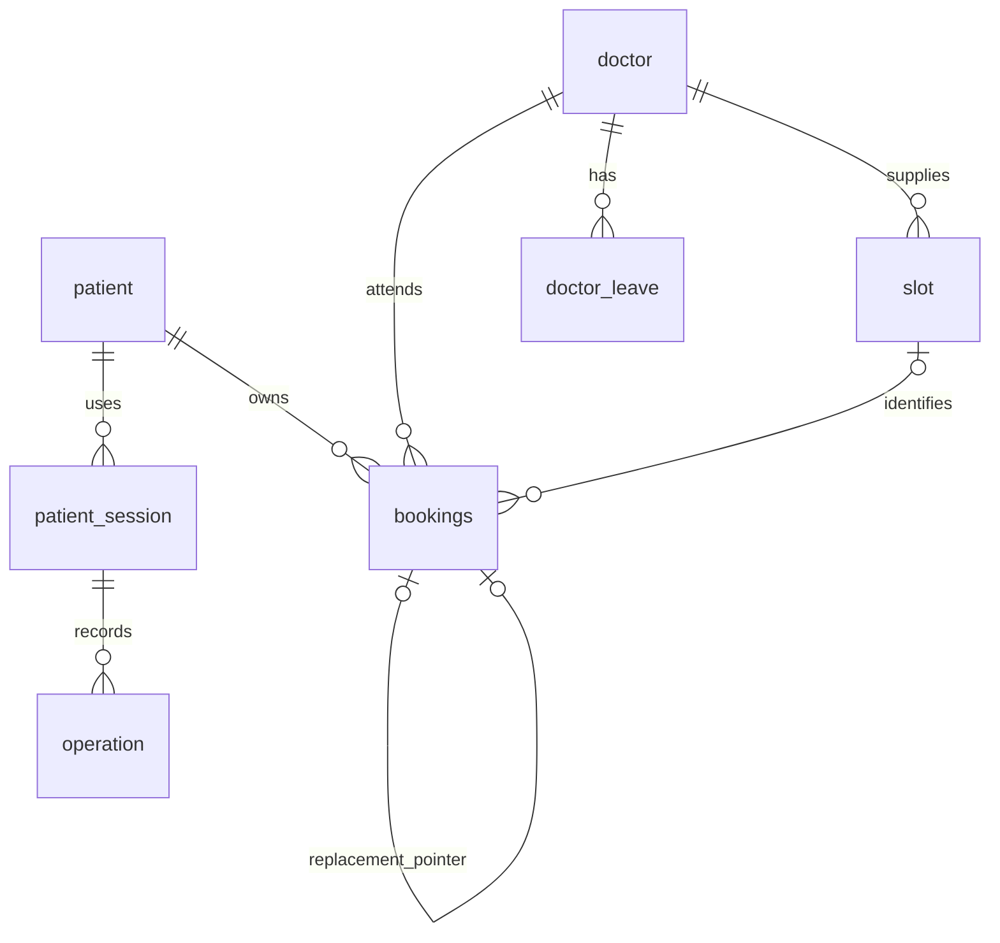

# Booking database design

The database stores real appointment state independently of model output. Python reads trusted doctor schedules and writes patient bookings. Supabase hosts standard PostgreSQL; no vector database, RAG table or serverless function is required for this phase.

## Relationships

The frozen SQL migration in `migrations/versions/0001_initial.sql` is the initial DDL; subsequent Alembic revisions extend it; `app/models.py` is the ORM mapping. Alembic tracks the migration version. No migrations run automatically at API startup.

| Table | Key fields | Responsibility |
|---|---|---|
| `patient` | UUID patient_id, name, phone, created_at | Synthetic patient identity for this demo. |
| `doctor` | UUID doctor_id, name, specialty_1/2/3 | Trusted doctor catalogue. |
| `slot` | UUID slot_id, doctor_id, weekday, start/end | Read-only weekly templates; Monday=0. |
| `doctor_leave` | UUID leave_id, doctor_id, start/end timestamptz, optional reason | Read-only partial/full-day unavailability. Reasons are not returned to patients. |
| `bookings` | UUID booking_id, patient_id, doctor_id, slot_id, date, snapshotted weekday/start/end, type, status, notes | Appointment source of truth. |
| `bookings` links | dependent_on_booking_id; superseded_by_booking_id | Distinguish a clinical follow-up relationship from rescheduling replacement. |
| `patient_session` | UUID session_id, token_hash, patient_id, expires_at, JSON state | Bind a random bearer token to one patient and persist workflow state. |
| `operation` | Composite session_id/request_id, request_hash, JSON response, created_at | Replay sequential retries and reconcile lost commit acknowledgements. |

UUIDs are generated by Python. SQL defaults are not required for those writes. External doctor-side integrations must supply required fields. `notes` is not populated from arbitrary model output.

## Time and availability

Weekly templates and booking snapshots use local clinic date/time. A single configured IANA timezone converts them into aware datetimes for leave overlap, patient overlap and notice policies. Changing the clinic timezone after bookings exist is unsupported; a future multi-clinic system should store explicit per-booking timezone/timestamps.

Leave, session expiry and creation timestamps are normalized to UTC on write and stored as `timestamptz`. Availability excludes past starts, leave, existing confirmed bookings for the doctor, and all overlapping confirmed bookings for the session patient. `[start,end)` interval semantics allow back-to-back appointments. Rescheduling excludes only the session patient's booking being replaced.

Scheduled bookings reference `slot.slot_id`; unscheduled follow-ups keep it null. Time snapshots remain stored for history. Candidate responses carry the current slot ID to revalidate against its template immediately before writing. The service does not validate or repair overlapping doctor templates. Valid and stable doctor-side schedules are an explicit assumption.

## Database checks and indexes

Checks restrict statuses, weekdays and positive same-day durations; require all four snapshot fields to be either present or null; require time for confirmed bookings; and require no time for pending scheduling. A booking cannot be its own follow-up parent. Foreign keys preserve referential integrity.

Indexes support doctor/date/status, patient/date/status, doctor/weekday, doctor leave, follow-up parents, reschedule replacements and patient sessions. The relationship indexes are added by migration `0ad7141776a3`. `token_hash` is unique; the operation composite primary key prevents duplicate stored request identities. Migration `603768ba3dac` adds the slot foreign key, a slot lookup index, a slot/date presence check and the partial unique index `uq_bookings_confirmed_slot_date` on `(slot_id, appointment_date) WHERE status = 'confirmed'`. Cancelled/rescheduled records retain history without blocking reuse. A weekly template can be booked on different dates. Existing scheduled records are backfilled by doctor, weekday and start/end; ambiguous or missing matches abort migration.

Same-patient follow-up ownership is verified by Python before scheduling. The external service creating follow-ups must also enforce that relationship. No patient API creates follow-up orders, completed visits, leave or templates.

## Transactions and concurrency boundary

One assistant request has one database transaction containing session changes, any booking mutation, and its saved response. Rescheduling marks the original rescheduled before inserting its replacement in that transaction; failure rolls both back. No success response is returned before commit.

Replay checks request ID plus a hash of the full validated request. Reusing an ID with different input returns 409. On an uncertain commit, the client retries the same request. A saved result is replayed if present; otherwise the transaction is attempted again with its still-pending proposal.

The database now prevents two confirmed bookings sharing a slot/date, including competing inserts. A uniqueness conflict returns HTTP 409 with `slot_unavailable`, with the losing transaction rolled back. There are still no explicit row/advisory locks, interval exclusion constraints, or concurrent idempotency resolution. Different-slot patient overlaps and concurrent session mutations remain possible; broader concurrency protection remains future work. This assumes correct, non-overlapping doctor-side templates.

## Supabase access

Tables live in a private `booking` schema, with PUBLIC schema privileges revoked and RLS enabled without public-client policies. Do not expose this schema through Supabase Data API. Only the Python backend holds the database connection credentials. The configured Supabase runtime role has no RLS bypass and only the approved table privileges/policies. These policies trust the server to act across its patients; service ownership checks remain essential. This build does not claim end-user Supabase Auth/RLS integration. The credential-free grant script is `scripts/runtime_access.sql`; login activation and password provisioning are separate administrative operations, already completed on Apex AI Arabia with user approval.
