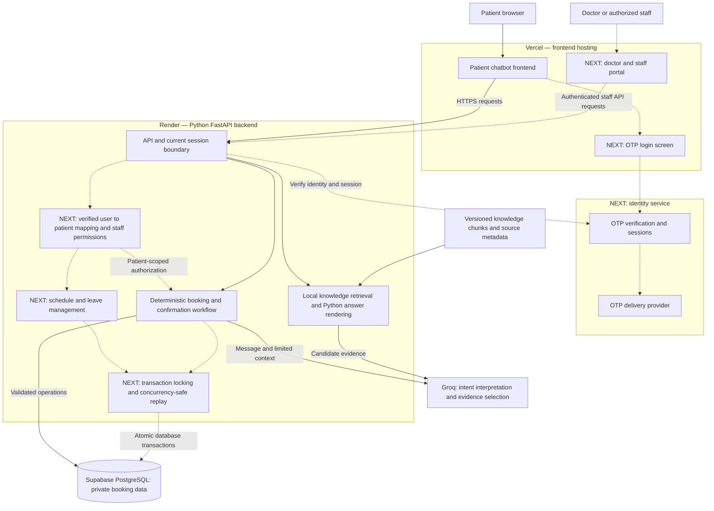

# What Works, What Does Not, What I Would Build Next.

**What works:** The take-home implementation separates a browser frontend from a Python FastAPI backend. It supports availability, confirmed booking, active appointment lookup, rescheduling, cancellation and evidence-backed knowledge answers. Python validates booking ownership against the current session, enforces confirmation and notice policies, and persists state in PostgreSQL. A database constraint prevents two confirmed bookings for the same slot/date.

**What does not:** The current login flow issues sessions for one shared synthetic demo patient. Individual patient OTP login, comprehensive concurrency control and doctor-side schedule management are not implemented. Human-approval requirements are detected, but no staff approval request is submitted. Hosting configuration exists; this document does not establish that the application has been deployed or is ready for real patient use.

**What I would build next, before production use:**

1. OTP patient login, with every patient restricted to fetching and changing their own records.
2. Database-backed locking and race-condition fixes for concurrent booking, rescheduling, cancellation and session updates.
3. An authenticated doctor/staff workflow for managing schedules, leave and appointments, replacing the assumption that doctor-side data is always correct.

These are proposed next-version changes. This document implements none of them.

## Part 10 — Production Architecture

### Proposed production architecture

Solid connections show the application/data flow retained from the take-home. Dashed connections and boxes marked **NEXT** represent additions for the next version. Vercel and Render are the intended deployment destinations; placement in this diagram is not a claim of an existing live deployment.

The current session boundary would be replaced by verified individual authentication for production, not left as an alternative bypass. The frontend would never connect directly to the private booking tables. Groq would continue to have no database credentials or authority to perform writes. The locking component is backend/database logic, not necessarily a new deployed service.

### Responsibilities by component

| Component | Production responsibility |
|---|---|
| Vercel frontend | Serve the patient UI and proposed login/staff interfaces; send authenticated requests to the API. Keep only public configuration in the frontend build. |
| Render FastAPI backend | Verify sessions, resolve identity, authorize access, interpret requests, retrieve evidence, enforce business rules and commit confirmed operations. |
| OTP identity service — next version | Deliver and verify login codes, issue sessions and support expiry/revocation. Supabase Auth is a candidate; provider integration has not been implemented. |
| Supabase PostgreSQL | Store patient mappings, doctor schedules, bookings, workflow state and operation records; enforce constraints and coordinate concurrent writes. |
| Groq | Interpret language and select retrieved evidence under strict schemas. It must not choose patient identity or authorize actions. |
| Knowledge corpus | Supply versioned facts and citations; remain backend-only. The current local retrieval approach can remain until evaluation demonstrates a need to replace it. |

### Change 1: OTP login and access to only the patient's own records

**Current:** The backend generates an expiring bearer token for the shared synthetic patient. Service queries check ownership against that session. These checks are useful, but do not establish which real patient is using the browser.

**Next version design:**

1. A dedicated login form collects the chosen login identifier and OTP. Codes and credentials are handled outside the chatbot and are never sent to Groq.
2. An identity provider verifies the code and establishes an authenticated session. Configure code expiry, resend/attempt limits and recovery procedures.
3. FastAPI verifies the session and maps its trusted user identity to a unique internal patient record. Do not trust a patient ID typed into chat or submitted by the browser.
4. Every patient record read and write uses that server-derived patient identity. A known booking UUID alone grants no access. Session state, replay records and knowledge context must also remain isolated between users.
5. Disable the shared demo-session endpoint in production. Test expired/revoked sessions, login switching and cross-patient requests.

For existing patient records, establishing the account-to-patient link needs a verified enrolment/recovery process. Possession of a phone number should not silently attach an account to an old patient record, particularly after number reassignment. Doctor/staff roles must be assigned through trusted administration, not user-editable profile values.

Database policies would be reviewed alongside this change. The current direct Python database connection does not automatically inherit a browser user's identity. Any per-patient database policy would require a deliberately implemented, transaction-scoped identity mechanism that cannot leak between pooled connections. Application ownership checks remain required. This is a design requirement, not a claim that existing RLS already isolates individual logged-in patients.

**Acceptance:** Patient A cannot list, fetch, cancel or reschedule Patient B's records even with B's UUID. Tampering with input cannot change the patient identity. OTPs and session secrets do not appear in model prompts or logs.

### Change 2: mutex locking and race-condition fixes

**Current:** Availability is rechecked before writes; transactions preserve atomic changes; sequential retries use stored operation responses. A partial unique index prevents duplicate confirmed bookings for a slot/date. These controls do not fully serialize concurrent requests for overlapping slots, the same booking or the same conversational state.

**Next version design:** Use database-coordinated transaction locking shared by all API workers. A process-local Python mutex alone would not coordinate separate workers or server instances.

- Serialize writes affecting a patient's appointment timeline using a stable database lock target; an empty result from an overlap query is not itself a lock on future bookings.
- Lock the affected booking and workflow/session state where necessary. Claim request IDs atomically so simultaneous identical requests cannot both execute.
- Coordinate doctor-side schedule edits with appointment writes through the same locking protocol. Acquire multiple resources in a consistent order to reduce deadlocks.
- After acquiring locks, reread status, availability, ownership and notice policy, then update the appointment and save the operation result in one transaction.
- Retain the slot/date uniqueness constraint as a final database safeguard. Handle lock timeouts and retryable conflicts with bounded recovery and the same request identity.
- Keep Groq and other network calls outside the locked transaction. Use state versions when applying interpretation after another request may have changed the conversation.

The exact lock granularity and any additional overlap constraints would be selected and tested during implementation. PostgreSQL row or transaction-scoped advisory locks are possible building blocks; this document does not prescribe an untested drop-in SQL patch.

**Acceptance:** Concurrent tests across separate database connections/workers demonstrate one winner for a slot, no overlapping patient bookings across doctors, no lost cancellation/reschedule updates, and one effect for repeated request IDs. A failed reschedule preserves the original appointment.

### Change 3: doctor-side workflows

**Current:** The patient service reads doctor records, weekly slots and leave. Valid, stable and non-overlapping doctor-side schedules are an explicit assumption. No doctor-facing schedule-management workflow is implemented.

**Next version design:** Add authenticated doctor and authorized staff access, with permissions distinct from patient access. Doctors would manage only their assigned schedules and appointments; broader administrative access would require an explicit role.

The workflow would support weekly availability templates, dated leave and exceptions, appointment status updates and appropriate follow-up creation. Validate overlapping templates before publishing. Schedule changes affecting existing bookings must identify those bookings and follow an explicit resolution process rather than silently deleting or moving them. Preserve historical appointment snapshots and audit who changed what. Use the same concurrency controls as patient booking operations.

**Acceptance:** One doctor cannot edit another doctor's schedule without an authorized role. Invalid overlaps are rejected. Leave/schedule edits cannot race with booking to create inconsistent availability, and existing booked patients are not silently displaced.

### Additional deployment work

| Area | Before real patient use |
|---|---|
| Environments and configuration | Separate test/staging/production data and secrets; set frontend API origin and backend allowed origin to the actual domains; disable demo access. |
| Data lifecycle | Apply reviewed migrations with backup and rollback procedures; test restore; exclude synthetic seed data from production. |
| Reliability | Add sanitized operational logs, audit events, alerts, request limits and provider failure monitoring. Exercise database/provider outages and recovery. |
| Knowledge governance | Assign source owners and review dates, evaluate retrieval quality and keep policy overrides aligned with implemented behaviour. |
| Human approval | Either build a real tracked staff approval workflow or clearly retain the external-contact limitation. Do not claim that an approval request was submitted when it was not. |
| Release checks | Run backend/frontend checks and the evaluation cases, then add OTP, cross-patient and simultaneous-request tests for the next version. |

The intended deployment remains frontend on Vercel, backend on Render and PostgreSQL on Supabase. Separating hosts is already supported; moving from a synthetic demo to production requires the identity, concurrency and operational work above. See [deployment instructions](deployment.md), [guardrails](part-5-guardrails-and-failure-handling.md) and [evaluation plan](part-6-evaluation.md).

### Technical references for the proposed additions

Supabase documents phone OTP authentication and session tokens in its [phone sign-in guide](https://supabase.com/docs/guides/auth/phone-login) and [JWT guide](https://supabase.com/docs/guides/auth/jwts). PostgreSQL documents cross-transaction coordination primitives in [Explicit Locking](https://www.postgresql.org/docs/current/explicit-locking.html). These support the proposed direction; no integration or locking change is implemented by this document.
