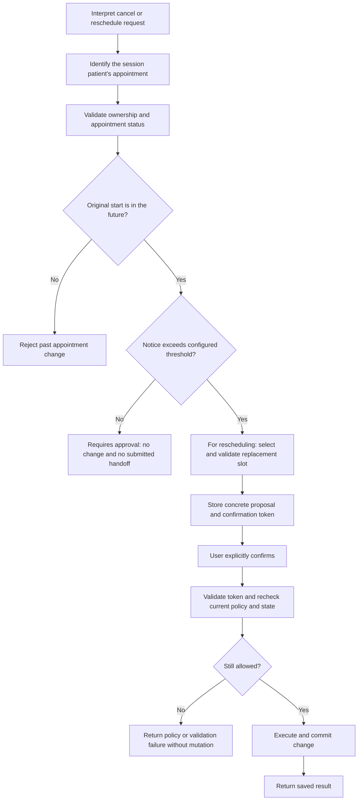

# Part 11 — Workflow vs Agent

## The approach taken

This implementation uses a **controlled workflow with model-assisted interpretation**, rather than an autonomous agent that chooses and executes its own sequence of tools. Groq helps interpret natural language and select knowledge evidence. Python decides which transitions are permitted, checks the database, requires confirmation and executes the defined operation.

This is appropriate because appointment changes have explicit rules and persistent consequences. The system needs flexibility in understanding “move my appointment to Thursday,” but it does not need discretion to waive a cancellation rule, choose a different patient or claim that staff approved an exception.

Here, an autonomous agent means a model-led loop that plans steps and chooses tool calls to achieve a goal. Such an agent could also be constrained by backend controls, but it would still need the same authorization and policy checks. Our narrower workflow avoids introducing that additional decision layer for operations whose allowed sequence is already known.

## Where control belongs

| Task | Approach used | Why |
|---|---|---|
| Interpret a request or date refinement | Groq extracts structured intent; Python calculates and validates dates. | Natural language varies, while dates and booking rules must be consistent. |
| Resolve the patient and appointment | Server session and owned database lookup. | A model's interpretation or a supplied UUID must not grant access to another patient's records. |
| Display availability | Python expands weekly templates and filters actual dates, occupancy, leave and patient overlaps. | The database determines availability; the model must not invent times. |
| Book, cancel or reschedule | Defined workflow, stored proposal, explicit confirmation and transactional service methods. | The exact requested change must be authorized and validated before saving. |
| Enforce the notice policy | Deterministic Python time comparison. | The same appointment and clock must produce the same policy decision regardless of wording. |
| Answer a knowledge question | Retrieve evidence, let Groq select allowed IDs, render in Python. | The model can help find relevant material without generating unsupported factual answers. |
| Handle approval-required changes | Stop automation and report the limitation. | The model cannot supply staff authority or invent a human handoff. |
| Report completion or failure | Backend result and transaction outcome. | A conversational claim is not evidence that a database change succeeded. |

The model does not receive database credentials, execute arbitrary SQL, or independently run booking tools. Confirmation is handled without asking the model whether the user has authorized the change.

## Cancellation and rescheduling within 24 hours

### The implemented rule

Cancellation uses `CANCELLATION_NOTICE_HOURS`; rescheduling uses `RESCHEDULE_NOTICE_HOURS`. Both default to **24 hours**, but are separate settings. The same default for rescheduling is an explicit assumption in the take-home design, not a universal clinic rule.

For an owned confirmed appointment, Python calculates:

```text
remaining_notice = original_appointment_start - current_clinic_time

if appointment_start <= current_clinic_time:
    reject as past_appointment
elif remaining_notice <= configured_notice_period:
    return requires_approval with code notice_policy
else:
    allow the normal proposal and confirmation flow to continue
```

The comparison uses timezone-aware times and the configured clinic timezone. **Exactly 24 hours is approval-required** under the defaults; automatic processing requires more than 24 hours. This is elapsed time, not a comparison of calendar dates.

For rescheduling, the notice period is measured against the **original appointment**, not the replacement date. Moving a near-term appointment to next week does not bypass the notice rule.

### Controlled sequence



Cancellation goes straight from the successful initial notice check to its cancellation proposal; it does not need a replacement slot. Other validation failures, such as a wrong/non-owned ID, stop the sequence before a proposal. Cancelling an already-cancelled owned appointment returns its existing state without repeating a mutation.

The policy is checked twice: when preparing the change, and again in the service method that executes confirmation. A previously issued confirmation token is not permission to ignore a policy that now blocks the change.

### Example 1: cancellation 23 hours away

Assume the clinic time is **6 October 2026 at 10:00 Asia/Riyadh** and the appointment starts **7 October at 09:00**. The patient asks, “Cancel my appointment.”

After identifying the owned booking, Python calculates 23 hours of notice. It returns:

```json
{
  "status": "requires_approval",
  "message": "This change requires human approval because the appointment is within 24 hours. No change was made and no approval request was submitted.",
  "data": {"code": "notice_policy"},
  "confirmation_token": null
}
```

This is an excerpt of the assistant response; the full envelope also includes `request_id`. The appointment remains confirmed. Saying “I accept the risk” or “the manager said it is fine” does not establish staff authorization and cannot waive the backend rule.

### Example 2: rescheduling a near-term appointment

The same patient says, “Move tomorrow's 09:00 appointment to next week.” The original appointment is still 23 hours away. Python returns `requires_approval` before proceeding with an automated reschedule. It does not release the original slot or create a replacement merely because the new date is far in the future.

### Example 3: eligible change and a crossed boundary

At 25 hours before the original appointment, the patient may proceed through normal cancellation or rescheduling confirmation, subject to the other validations. For rescheduling, the replacement must be available, with the same doctor, and different from the current time.

If a proposal is created at **24 hours and 2 minutes** before the original appointment and confirmed three minutes later, it is now inside the notice boundary. Even if the token has not expired, the execution-time check returns `requires_approval`; no appointment change is saved.

## Why this is preferable to autonomous action

1. **Consistent policy enforcement.** The threshold is configuration plus a Python comparison, rather than a decision influenced by the model's phrasing, uncertainty or sympathy for the request.
2. **A clear authority boundary.** Patient confirmation authorizes an otherwise permitted action; it does not override clinic policy. Staff approval would require a separate authenticated mechanism.
3. **No invented escalation.** The workflow returns the factual state: approval is required, but no request has been submitted. An autonomous conversational plan cannot stand in for a functioning staff integration.
4. **Controlled side effects.** Cancellation changes status; rescheduling preserves the old record and creates a linked replacement in a transaction. The model cannot improvise a cancel-then-book workaround that leaves the patient without the original appointment after failure.
5. **Testable boundaries.** Tests can freeze the clock and check exactly 24 hours, 23 hours, and just over 24 hours. They can also verify unchanged records after rejection and revalidation at confirmation.
6. **Honest failure reporting.** Provider failure, unavailable slots and uncertain database outcomes have explicit paths. The response comes from the outcome of those paths rather than a generated claim of success.

This does not make the whole system infallible. The model can still misunderstand intent, and current concurrency controls are incomplete. Controlled transitions make these risks easier to isolate and test; they do not replace the planned race-condition fixes.

## Where bounded agent behaviour could help later

A future assistant could compare alternative dates or help staff review a request using approved read-only tools. Any patient-record access would remain authorized, and any proposed change would still pass through the same deterministic booking service and confirmation policy. Greater autonomy is not needed to waive a notice rule.

If human escalation is implemented in a later version, the controlled workflow could create a real approval ticket, wait for an authenticated staff decision, and then revalidate before applying the approved change. Until then, the correct result is to stop and explain that the patient needs an external clinic approval channel. No such ticket or staff workflow currently exists.

## Implementation and verification references

- [workflow.py](../app/workflow.py): target selection, initial policy check, proposal, confirmation-token validation and dispatch to the defined service method.
- [booking_service.py](../app/booking_service.py): `check_change()`, `cancel()` and `reschedule()`, including the execution-time notice check.
- [config.py](../app/config.py): separate cancellation and rescheduling thresholds, both defaulting to 24 hours.
- [groq_client.py](../app/groq_client.py): model interpretation/evidence-selection contracts; no autonomous tool loop.
- [test_booking.py](../tests/test_booking.py): cancellation boundary, confirmation, rescheduling and no-fake-escalation tests. These existing tests do not imply every narrative scenario above has a dedicated automated test.
- [Part 5 — Guardrails & Failure Handling](part-5-guardrails-and-failure-handling.md) and [Part 6 — Evaluation](part-6-evaluation.md): detailed failure paths and evaluation criteria.

This document explains the current approach. It does not add staff approval, change the notice period or implement new application behaviour.
